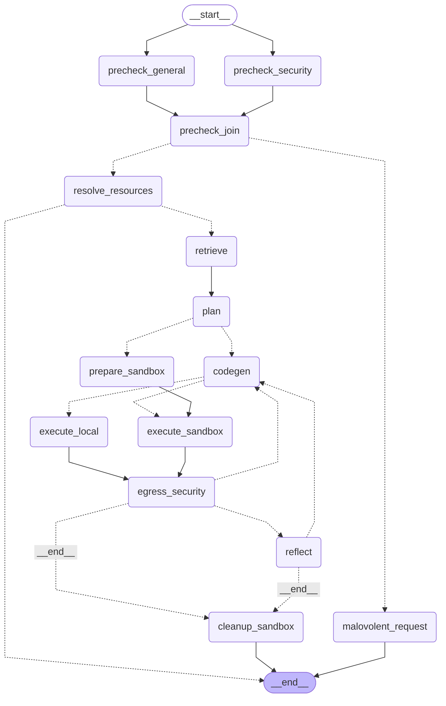

# Architecture

This document explains the system as a whole: the runtime flow, the state that moves between stages, the default configuration choices, and the tradeoffs that shaped the current design.

Component-specific tradeoffs live in [COMPONENTS.md](COMPONENTS.md). Evaluation-specific details live in [EVALUATION.md](EVALUATION.md).

## 1) End-to-End Flow

The runtime is intentionally split into narrow nodes so each step can be tested, mocked, and reasoned about independently.

The conceptual sequence is:

1. User prompt enters the system.
2. General and security guardrails classify the request.
3. Mentioned pages are inferred as titles, normalized, and resolved to page IDs.
4. Retrieval context is selected from hardcoded context or dynamic RAG.
5. Planning is optional.
6. Code is generated.
7. Execution happens in local or sandbox mode.
8. Telemetry and the execution envelope produce user-facing output plus page IDs.
9. The CLI renders the final result and the evaluation layer can later read the same state shape.

## 2) State Contract

The runtime state is not a single opaque blob. It is a staged contract, and each step owns a small slice of it.

### Canonical inputs

- `task_id`
- `user_prompt`
- Configuration from `RunnableConfig`

These are the stable starting points. Everything else is derived from them or from the current run.

### Inferred fields

- `meta.reasoning`
- `meta.relevant_to_notion_scope`
- `meta.required_resources`
- `security.is_safe`
- `resource_map`
- `retrieval_context`
- `queries`
- `request_plan`
- `general_info`
- `generated_code`
- `function_name`
- `solution_run`
- `execution_output`
- `message_to_user`
- `feedback`
- `retry_context`
- `verdict`
- `relevant_page_ids`
- `affected_notion_ids`
- `sandbox_id`
- `terminal_status`

### Canonical once resolved or executed

- `resource_map` becomes the runtime source of truth for resolved page titles and IDs.
- `relevant_page_ids` becomes the canonical list of IDs that the execution envelope wants the UI to render.
- `affected_notion_ids` becomes the merged render set after telemetry and envelope data are combined.
- `message_to_user` becomes the final user-visible summary when the execution envelope provides one.

### Evaluation truth

For evaluation runs, the canonical truth is not in runtime state. It lives in the LangSmith dataset `reference_outputs`.

## 3) Guardrails and Title Inference

### General precheck

The general precheck classifies whether the user request is in Notion scope and extracts titles that must already exist before execution.

It does not try to create new object names or property names. The prompt explicitly tells the model to return only existing page titles in `required_resources`.

The output is normalized immediately:

- lowercase
- underscore-to-space conversion
- whitespace collapse
- duplicate removal while preserving first-seen order

This normalization is mirrored in evaluation so capitalization and formatting noise do not dominate scoring.

### Security precheck

The security precheck classifies the request as safe or unsafe before the resolver or code generator runs.

That split matters because a request can be syntactically valid for Notion while still being unsafe, irrelevant, or deliberately malicious.

### Why title inference is separate from resolution

The model first infers mentioned page titles, then the resolver turns those titles into IDs.

That separation keeps the system testable:

- the guardrail is evaluated as inference quality
- the resolver is evaluated as search and ambiguity handling
- the downstream code generator only sees stable IDs in `resource_map`

## 4) Resource Resolution

Each required page title is searched individually.

Resolution behavior:

- one title in, one search call out
- one result means the ID is accepted immediately
- multiple results trigger interactive disambiguation when the CLI callback exists
- multiple results in non-interactive runs return a failure with candidate titles and IDs
- search or transport errors are surfaced as execution failures

The resolver is conservative by design. If a title cannot be resolved cleanly, the node returns a failure status and keeps the partial `resource_map` for debugging. That prevents later steps from running against an incomplete set of IDs.

If you want a more permissive policy that keeps searching later titles after a miss, that would be a separate behavior change. The current architecture prefers correctness and explicit failure over silent partial execution.

### Shared title helpers

The runtime and evaluation layers reuse the same normalization ideas:

- `normalize_title_for_match(...)` lowercases, replaces underscores, and collapses whitespace for search matching.
- `extract_result_title(...)` reads the title from Notion search results.
- `pick_exact_or_first_match_id(...)` prefers exact normalized matches, then falls back to the first valid ID.

This keeps human-entered titles, search results, and evaluation comparisons aligned.

## 5) Retrieval, Context Strategy, and Planning

The current default is a hardcoded context rather than live augmented retrieval.

Why:

- The project originally experimented with dynamic RAG over Notion docs.
- The context pipeline was more sensitive than expected to chunking strategy and retrieval complexity.
- A simpler fixed context was empirically better for this workload.

The active default context is a curated summary of the Notion documentation, created from a map-reduce style summarization pass and then stabilized into named context files.

That choice is deliberate:

- it is deterministic
- it is easier to test
- it avoids retrieval noise
- it still provides enough API guidance for the current tasks

Dynamic RAG remains available as an optional mode, but it is no longer the default path.

### Planning

Planning is also optional and disabled by default.

The reason is pragmatic: for the current tasks, the user prompt already carries enough actionable intent to go straight from context to code generation. A planning proxy did not add enough value to justify the extra step for baseline runs.

## 6) Execution Backends

There are two execution paths, and both feed the same result model.

### Local execution

- Runs generated code via the local Python interpreter.
- Writes code into `data/solutions/<task_id>.py`.
- Useful for debugging and simple test runs.
- Less isolated than sandbox execution.

### Sandbox execution

- Runs code in an E2B sandbox.
- Defaults to network access only for `api.notion.com`.
- Propagates only `NOTION_*` environment variables into the sandbox.
- Uses explicit prepare, execute, and cleanup steps.
- Is the default for production-like runs because it is safer and closer to the intended runtime boundary.

Both backends return the same `ExecutionResult` shape, so the rest of the pipeline can stay backend-agnostic.

## 7) Telemetry and Output Envelope

The execution system does two different jobs at once.

### Telemetry

Generated code is wrapped with a request interceptor that watches HTTP traffic to Notion page and block endpoints.

It captures:

- read page IDs
- mutated page IDs

This is needed because the generated script does not always print a clean summary of which pages it touched.

### Output envelope

The generated code can also emit a JSON envelope in stdout. The envelope parser extracts:

- `message_to_user`
- `relevant_page_ids`
- `execution_status`

The execution envelope is then merged with telemetry:

- `message_to_user` becomes the final user-facing text if provided
- `relevant_page_ids` becomes the UI render set from the envelope
- `affected_notion_ids` merges envelope IDs with mutated IDs from telemetry

That split is intentional:

- telemetry says what the code actually touched
- the envelope says what the code wants the user to see
- the UI combines both so rendering is useful even when only part of the output is explicit

## 8) Fallback and Compatibility Behavior

The system retains a few compatibility paths on purpose.

### Telemetry fallback

If direct ID extraction from stdout and stderr does not work, the code falls back to reading the affected-ID file path:

- local runs use `data/tmp_affected_ids.json`
- sandbox runs use `/tmp/affected_ids.json`

This keeps older execution paths working even if the textual telemetry markers are missing.

### Markdown fallback

Page rendering uses a markdown helper that can recursively follow `unknown_block_ids`.

Behavior:

- nested inaccessible blocks are skipped when they produce 404s
- a root page 404 still fails loudly

That keeps rendering resilient without masking root-level permission or lookup problems.

### SDK compatibility

The sandbox utilities include an import fallback for different E2B SDK layouts. This is not a business feature; it is a compatibility shim so the project can survive minor package shape differences.

## 9) Configuration and Environment

The runtime environment is split intentionally.

### Stable configuration

- `.env` stores stable secrets and default IDs
- Notion access uses `NOTION_TOKEN`
- OpenAI-compatible calls use `GOOGLE_API_KEY`
- LangSmith evaluation uses `LANGSMITH_API_KEY` or `LANGCHAIN_API_KEY`
- Sandbox provisioning uses `E2B_API_KEY`
- Safety checks can use `POETRY_API_KEY`
- Notion rendering and retrieval use the configured Notion version header

### Ephemeral sandbox state

- `.env.sandbox` stores generated IDs
- sandbox values override overlapping values from `.env`
- evaluation provisioning writes to `.env.sandbox` without overwriting stable secrets

### Runtime knobs

- `context_used` selects hardcoded context or dynamic retrieval
- `enable_planning` toggles planning
- `reflector_used` selects self, none, or external reflection
- `execution_method` selects local or sandbox execution
- `max_trials` bounds retry count
- `max_rendered_relevant_page_ids` limits UI rendering payloads
- `post_dataset_sync_delay_seconds` absorbs Notion search/index lag after dataset refresh

## 10) Evaluation and Validation

Evaluation is not a sidecar. It is part of the design.

### Dataset-driven truth

LangSmith datasets are the canonical source of truth for evaluation tasks.

The orchestration layer ensures examples exist and updates them when task inputs drift, so the dataset stays aligned with the YAML specs.

### Title-search metrics

The title-search evaluation measures the handoff from precheck to resolver.

Metrics include:

- exact boolean matching for `relevant_to_notion_scope`
- normalized equality for `required_resources`
- top-1 and top-3 hit checks against reference titles
- mention-count equality between inferred titles and referenced titles

The metrics are intentionally about search behavior, not about exact corpus-wide retrieval quality.

### Precheck metrics

The general precheck evaluation measures inference quality:

- whether the request is in Notion scope
- whether the model inferred the correct existing page titles

### Codegen evaluation

The codegen evaluation runs a partial live pipeline and scores both code statements and execution behavior.

### Provisioning and error analysis

Evaluation settings can provision sandbox infrastructure before runs, and shared orchestration can trigger automated error analysis afterward.

That gives the project a loop from task spec to dataset to runtime to diagnosis.

## 11) Tradeoffs and Caveats

The current architecture intentionally prefers narrow, explicit nodes over a larger agentic monolith.

Why:

- each node is easier to test in isolation
- failures are easier to localize
- evals can focus on one transition at a time
- partial state is easier to inspect and reuse

Important caveats:

- Notion search is fuzzy and ranking can vary.
- Normalization reduces user formatting noise but can hide small title differences.
- The current resolver is conservative and stops on hard misses or ambiguity rather than silently continuing with incomplete information.
- Planning is optional because the prompt itself usually carries enough intent.
- The self-correction loop is preferred because execution tracebacks already provide the main repair signal; a separate critique pass would add complexity without enough benefit for this app.

## 12) Active vs Non-Default Components

Still active, but not default in baseline runs:

- dynamic RAG retrieval
- request planning
- external reflection

Compatibility and legacy paths that are intentionally retained:

- SDK import fallback for E2B
- telemetry file fallback
- legacy prompt fields and repair hints

These paths exist to keep experiments reproducible and to avoid breaking older runs or test fixtures.
